<div align="center">

# 🌉 AI Magpie Bridge

<h3 align="center">🚀 A safe replacement bridge between conversational AI and local code 💡</h3>
<h3 align="center">🚀 连接对话式 AI 与本地代码的安全替换桥梁 💡</h3>

<p align="center">
  
  
  
  
</p>


<p align="center">
  English｜
  <a href="./README.zh-CN.md">简体中文</a>
</p>

<p align="center">
  <a href="#-overview">Overview</a>｜
  <a href="#-interface-preview">Interface Preview</a>｜
  <a href="#-dynamic-demo">Dynamic Demo</a>｜
  <a href="#-why-this-tool">Why This Tool</a>｜
  <a href="#-features">Features</a>｜
  <a href="#-quick-start">Quick Start</a>｜
  <a href="#-full-usage-example">Full Usage Example</a>｜
  <a href="#-replace-block-format">Replace Block Format</a>｜
  <a href="#-faq">FAQ</a>｜
  <a href="#-license">License</a>
</p>

<br>

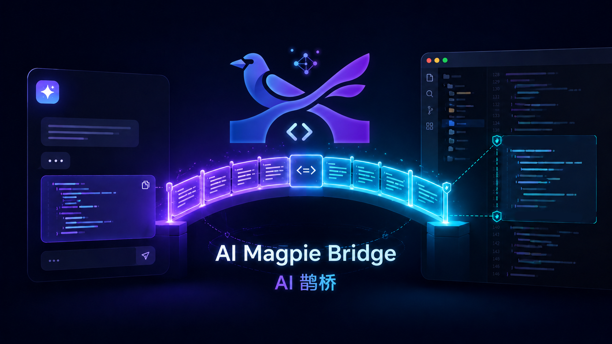

</div>

---

## 📌 Overview

**AI Magpie Bridge** is a desktop tool that connects conversational AI with local code files through a safe and explicit replacement workflow.

Instead of granting AI direct access to your filesystem, it asks AI to output reviewable replace blocks, then applies them locally through exact matching.

It is designed to work with conversational AI tools such as **ChatGPT, Claude, Gemini**, and other advanced LLM-based coding assistants.

Traditional workflow:

> Copy code to AI → Receive suggestions → Manually search → Manually replace → Save file

With this tool:

> AI outputs structured replace blocks → The tool parses them → Apply changes with one click → Save automatically

The main goal of this project is to make AI-assisted programming **safer, faster, cheaper, and easier to control**.

---

## 🖼️ Interface Preview

### Main Window

The left side is the project/file tree, the center is the code editor, and the right side is the AI replace-block input and quick action area.

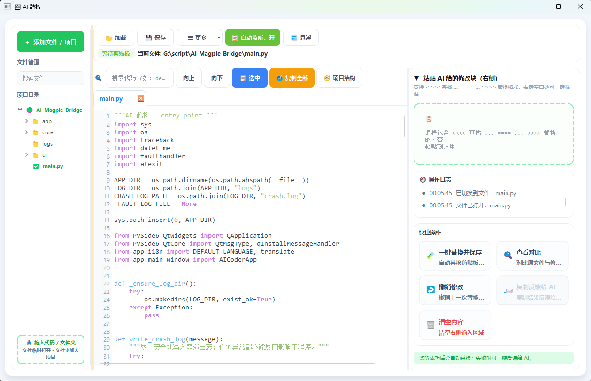

---

### Copy Current File with One Click

Click **Copy All** to quickly copy the full content of the current file, then send it to ChatGPT, Claude, Gemini, or other conversational AI tools for analysis and modification.

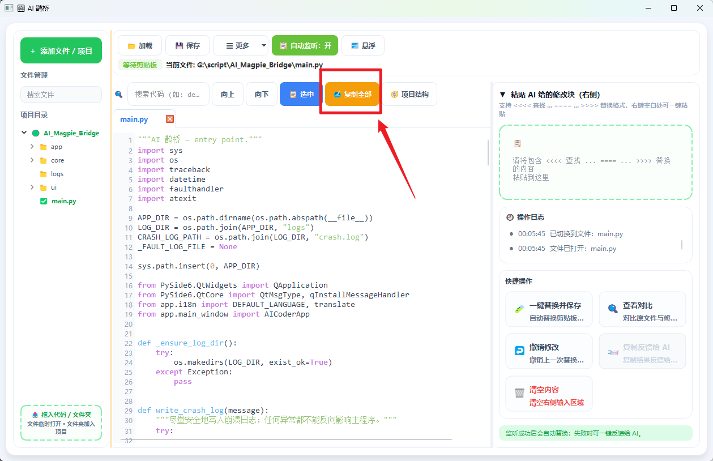

Useful for:

- Helping AI understand the complete current file
- Asking AI to generate replace blocks based on full context
- Avoiding missing context caused by copying only partial code

---

### Copy Project Structure with One Click

Click **Project Structure** to copy the current project tree to AI, helping it understand relationships between files.

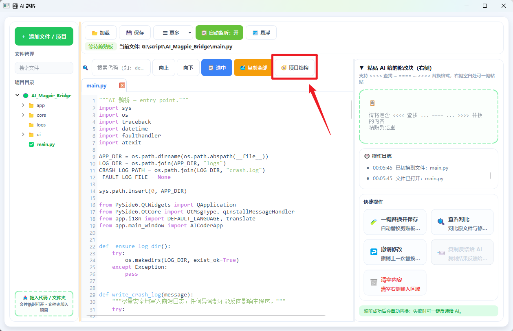

Useful for:

- Multi-file modifications
- Helping AI decide which file should contain the change
- Asking AI to output replace blocks with `<<<< 文件:` paths
- Helping AI better understand project layering

---

### Multi-language Interface

Use **More → Language** to switch the UI language for different working environments.

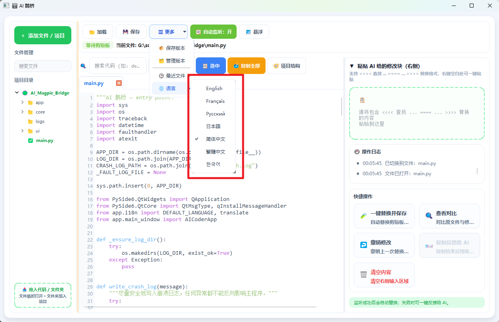

Currently supported:

- 简体中文
- 繁體中文
- English
- Français
- Русский
- 日本語
- 한국어

---

## 🔥 Why This Tool

Modern AI coding agents are powerful, but they also introduce several practical problems:

- **Black-box operations**
  - Many agents directly read, write, create, delete, and refactor files.
  - Users often do not clearly know what the agent has changed until after the operation is done.
  - A small instruction may trigger a large chain of hidden file operations.

- **High token and monetary cost**
  - Agent-style workflows often repeatedly scan files, build context, plan, execute, verify, and retry.
  - Even a small change may consume a huge number of tokens.
  - In some cases, modifying a tiny piece of code may cost several dollars or even tens of dollars.
  - Long-running agent tasks may also require waiting for many minutes.

- **Unnecessary waiting time**
  - Agents often perform multiple tool calls, file reads, terminal commands, and verification steps.
  - For small and medium-sized changes, this may be much slower than directly asking a top conversational AI model to generate the patch.

- **Risk of unintended or malicious operations**
  - Some low-cost or untrusted AI platforms may hide unexpected behavior in automated agent workflows.
  - Agent tools with file access may accidentally or intentionally modify unrelated files.
  - Misconfigured agents may delete files, overwrite important content, or introduce hidden changes.

This project provides a different workflow:

> You control the context → AI generates explicit replace blocks → The tool applies only exact matched changes.

Instead of letting an agent freely operate on your project, this tool keeps the process transparent and controlled:

- AI cannot directly touch your files.
- Every modification is represented as an explicit replace block.
- Old code must match exactly before replacement.
- Ambiguous matches are skipped automatically.
- Failed changes can be fed back to AI with one click.
- You can use the most advanced conversational AI models without giving them direct filesystem control.

For many coding tasks, this can be dramatically more efficient:

- One AI conversation can produce a large amount of high-quality code.
- Only the required code context needs to be sent.
- No repeated agent tool calls are needed.
- Small changes can be completed in seconds instead of minutes.
- Token usage and API cost can be significantly reduced.

In short:

> **This tool combines the intelligence of conversational AI with the safety of precise local replacement.**

---

## ✨ Features

- **Multi-tab code editor**
  - Open multiple files at the same time
  - Line number display
  - One Dark styled Python syntax highlighting

- **AI replace block parsing**
  - Supports `<<<< 查找 ... ==== ... >>>> 替换` format
  - Supports multiple replace blocks in one response
  - Supports cross-file replacement
  - Supports code deletion by leaving the replacement content empty

- **Clipboard auto-monitoring**
  - Automatically detects AI responses copied to the clipboard
  - Applies replacements automatically when the match is unique
  - Safely skips invalid, unmatched, or ambiguous replacements

- **One-click failure feedback**
  - Automatically summarizes replacement failure reasons
  - Includes the current full source code
  - Generates feedback that can be pasted back to AI for retry

- **Cost-efficient AI workflow**
  - Avoids repeated agent loops and unnecessary tool calls
  - Reduces token usage by sending only the required code context
  - Lets conversational AI generate large code changes quickly
  - Helps avoid spending excessive money on small modifications

- **Safer than black-box agents**
  - AI has no direct write access to your project
  - Replacements are only applied when old code matches exactly
  - Multiple matches are skipped to avoid accidental edits
  - Reduces the risk of hidden modifications, file deletion, or unwanted operations

- **Key version management**
  - Save important versions manually
  - Compare versions
  - Restore historical versions
  - Delete unused versions

- **Project structure copying**
  - Copy the active project tree with one click
  - Help AI understand the project context
  - Improve path accuracy for multi-file modifications

- **Responsive desktop UI**
  - Automatically switches to compact mode when the window is narrow
  - Buttons, input areas, and operation panels adapt to the layout

- **Persistent state**
  - Restore previous window position
  - Restore previously opened tabs
  - Track recent files
  - Support multi-language UI

---

## 🧭 Use Cases

This tool is especially useful if you:

- Frequently ask AI to modify Python code
- Want to avoid manual copy-search-replace operations
- Want to reduce the cost of agent-style coding workflows
- Need AI-generated changes to be applied reliably
- Want to keep AI away from direct filesystem operations
- Want to prevent accidental file deletion or unrelated modifications
- Need key version backups for rollback
- Prefer a transparent desktop workflow instead of black-box IDE agents

---

## 📁 Project Structure

```text
├── main.py                     # App entry + global stylesheet
├── 启动.bat                    # Windows launch script
├── docs/images/                # README screenshots and interface images
├── docs/gif/                   # README animated demo GIFs
├── settings.json               # Local settings, generated at runtime
├── key_versions/               # Key version backups
├── ui/                         # UI components
│   ├── highlighter.py          # Python syntax highlighter
│   ├── code_editor.py          # Code editor with line numbers
│   ├── editor_tab.py           # Single editor tab
│   ├── widgets.py              # Common widgets
│   └── dialogs.py              # Dialogs
├── core/                       # Core logic layer
│   ├── replace_engine.py       # Replace block parsing, signature, deduplication, application
│   └── file_ops.py             # File operations and JSON persistence
└── app/                        # Main window and application logic
    ├── main_window.py          # Main application class
    ├── ui_builder.py           # UI builder and responsive layout
    ├── tab_manager.py          # Tab and file lifecycle
    ├── project_manager.py      # Project tree and project context copying
    ├── i18n.py                 # Internationalization
    └── clipboard_feedback.py   # Clipboard monitoring, diagnostics, and AI feedback
```

> The actual file structure may change slightly as the project evolves.

---

## ⚙️ Requirements

- Python 3.8+
- PySide6

Install dependencies:

```bash
pip install PySide6
```

If you need to run the Traditional Chinese locale generation script, OpenCC may also be required:

```bash
pip install opencc-python-reimplemented
```

---

## 🚀 Quick Start

### Launch from command line

Run in the project root directory:

```bash
python main.py
```

### Launch with Windows batch script

Double-click:

```text
启动.bat
```

If it fails to start, check whether the Python path in `启动.bat` is correctly configured.

---

## 🧑‍💻 Basic Workflow

1. Click **Load** or **Add File / Project**
2. Open a Python file, or drag a file/folder into the window
3. Click **Copy Selected**, **Copy All**, or **Project Structure** to send context to AI
4. Ask AI to output changes in the required replace block format
5. Paste the AI response into the right input panel
6. Click **Apply and Save**
7. The tool parses, applies, and saves the changes automatically

## 🎬 Dynamic Demo

### Basic Workflow

From copying code context, asking AI to generate replace blocks, to pasting and applying changes with one click, the complete workflow is shown below:

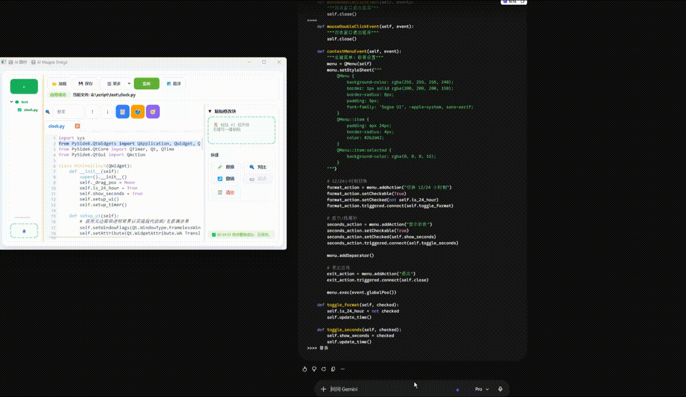

Core workflow:

```text
1. Open the target file or project
2. Copy the current code or project structure to AI
3. AI returns replace blocks in the standard format
4. Paste the replace blocks into AI Magpie Bridge
5. The tool parses and exact-matches the old code
6. Apply the replacement with one click and save automatically
```

---

### Auto-monitoring & Clipboard Feedback Demo

After auto-monitoring is enabled, copied AI replace blocks can be detected automatically. When the old code has a unique match, the tool replaces and saves automatically. If replacement fails, it avoids accidental edits and can generate feedback for AI with one click.

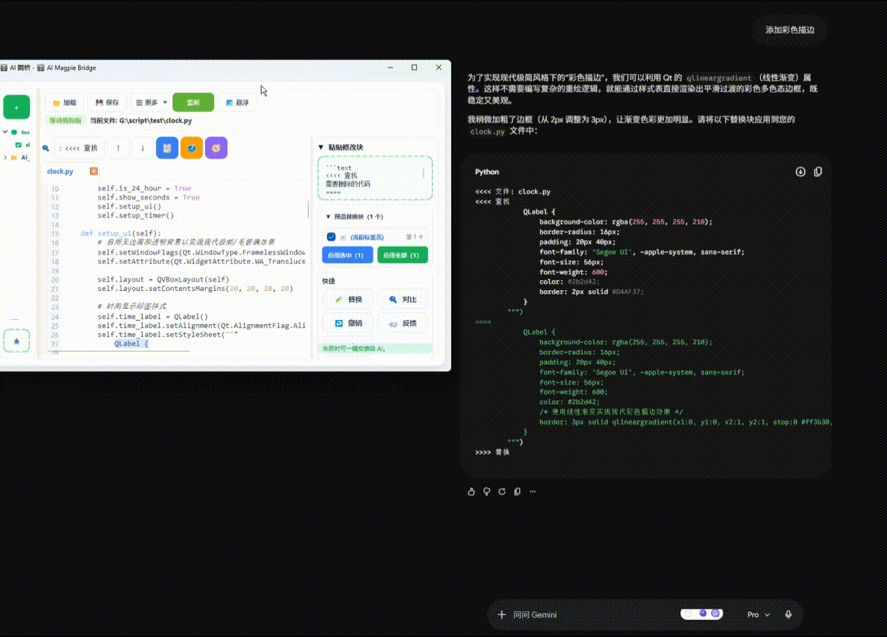

In auto-monitoring mode, the tool prioritizes safety:

```text
Copy valid replace blocks → Detect automatically → Unique match → Replace and save automatically
Copy normal text → Skip automatically
Copy incomplete content → Skip automatically
Old code not found or matched multiple times → Do not modify files, feedback can be sent to AI
```

The goal of this design is to make auto-monitoring more efficient without sacrificing safety.

---

## 🎬 Full Usage Example

The following example shows a complete workflow: using AI to generate a PySide6 desktop clock and applying the changes automatically with AI Magpie Bridge.

### 1. Tell AI to Use the Fixed Replace Block Format

Before asking ChatGPT, Claude, Gemini, or other conversational AI tools to modify code, it is recommended to first send a fixed prompt so that AI strictly follows the replace block format supported by AI Magpie Bridge.

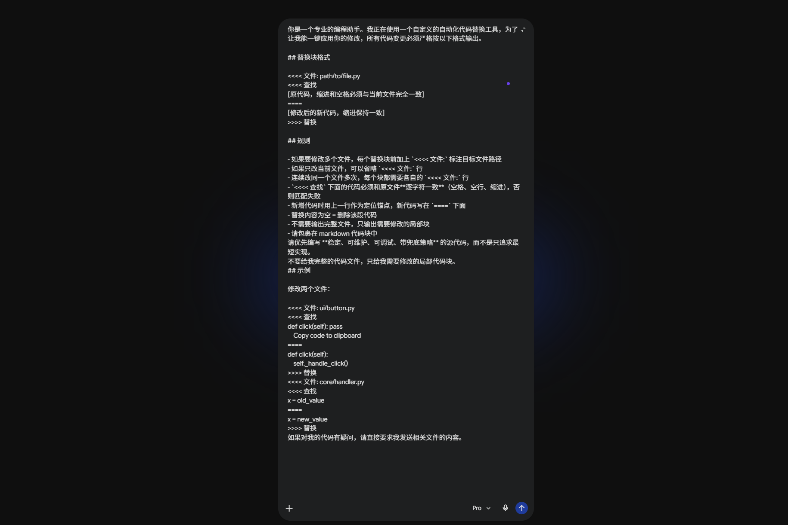

AI responses should follow this format:

```text
<<<< 文件: path/to/file.py
<<<< 查找
old code
====
new code
>>>> 替换
```

---

### 2. Create a File and Drag It into AI Magpie Bridge

Create a target file locally, for example:

```text
clock.py
```

Then drag the file into AI Magpie Bridge, or open it through **Add File / Project** on the left side.

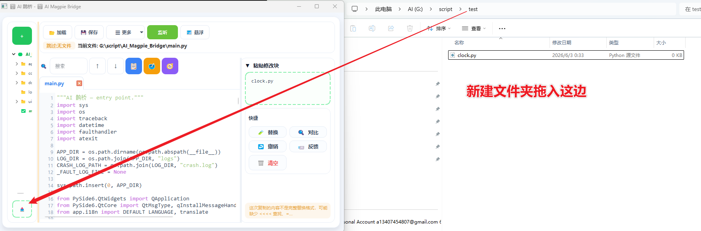

---

### 3. Enable Auto-Monitoring

Click **Auto Monitor: On** at the top.

After enabling it, you only need to copy the replace blocks returned by AI, and AI Magpie Bridge will automatically detect clipboard content.

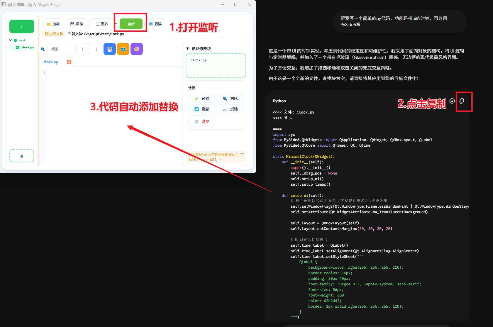

In auto-monitoring mode, the tool tries to complete the following flow automatically:

```text
Copy AI response → Detect replace blocks → Exact match → Replace code → Save file
```

If the format is incomplete, the old code is not found, or the old code appears multiple times, the tool skips the operation to avoid accidental edits.

---

### 4. Ask AI to Generate the First Runnable Version

For example, ask AI:

```text
Help me create a simple PySide6 UI clock with a modern minimalist style.
```

After AI returns standard replace blocks, copy the response.

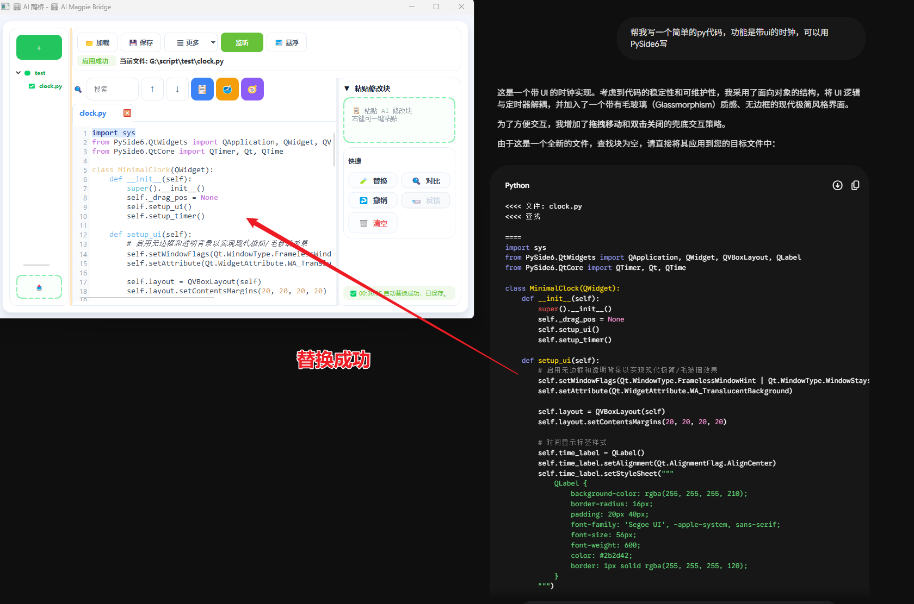

AI Magpie Bridge detects the replace blocks from the clipboard and automatically writes the code into `clock.py`.

---

### 5. Local File Is Updated Automatically

After successful replacement, the code appears in the local file and is saved automatically.

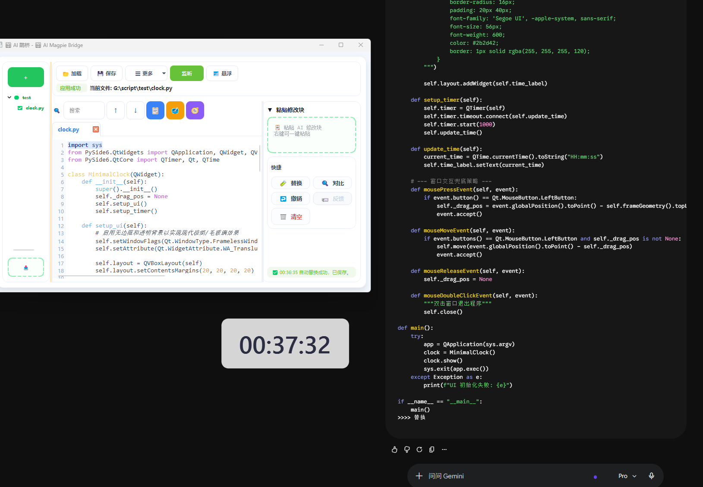

This step does not require AI to directly operate on your filesystem.  
AI only outputs text, and the actual file replacement is done locally by AI Magpie Bridge.

---

### 6. Continue Asking AI to Enhance the Feature

You can continue describing new requirements in natural language, for example:

```text
Add a right-click menu to the clock, supporting 12/24-hour switching, seconds display toggle, and exit.
```

AI will continue returning one or more replace blocks.

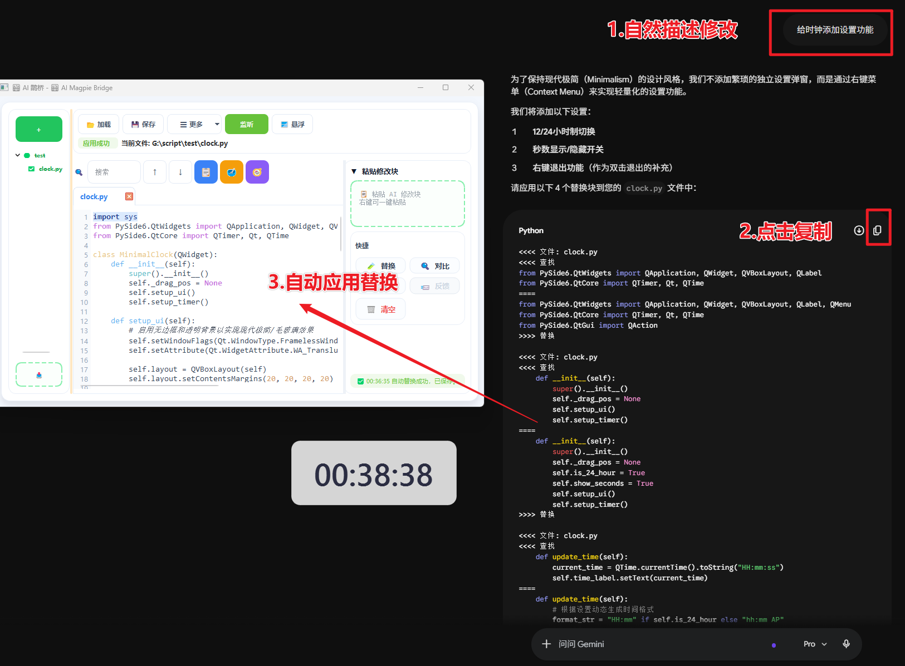

---

### 7. Apply the Next Changes Automatically

After copying the AI response, AI Magpie Bridge continues applying the modifications automatically.

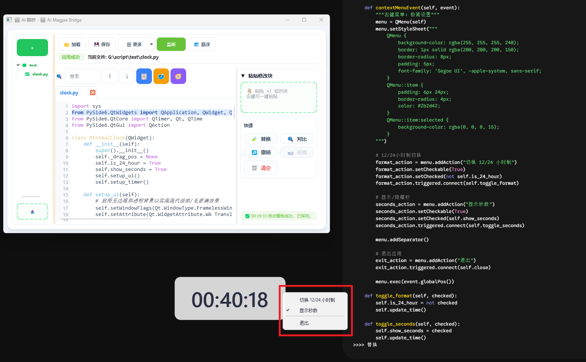

The final workflow is:

```text
Describe requirements in natural language
↓
AI generates replace blocks
↓
AI Magpie Bridge applies them automatically
↓
Local code is updated and saved
```

The whole process does not require an agent to directly read or write files, and it avoids manual searching and pasting.

---

## 🧾 Replace Block Format

### Single-file replacement

```text
<<<< 查找
old code
====
new code
>>>> 替换
```

### Multi-file replacement

```text
<<<< 文件: app/main_window.py
<<<< 查找
old code A
====
new code A
>>>> 替换
<<<< 文件: core/replace_engine.py
<<<< 查找
old code B
====
new code B
>>>> 替换
```

### Delete code

If the content below `====` is empty, the matched code will be deleted.

```text
<<<< 查找

====

>>>> 替换
```

---

## 📐 Replacement Rules

- The code under `<<<< 查找` must match the current file **character by character**
- Spaces, indentation, blank lines, and punctuation must be preserved
- If the old code appears multiple times, auto mode will skip it to avoid incorrect changes
- For multi-file changes, always provide the `<<<< 文件:` path
- Empty replacement content means deleting the matched code
- For the best success rate, ask AI to output replace blocks only, without explanations

---

## 📋 Recommended Prompt for AI

You can use the following prompt when asking AI to modify your code:

```text
You are a professional programming assistant. I am using a custom automated code replacement tool. To let me apply your changes with one click, all code changes must strictly follow the format below.

## Replace Block Format

<<<< 文件: path/to/file.py
<<<< 查找
[Original code. Indentation and spaces must exactly match the current file.]
====
[Modified code. Keep indentation consistent.]
>>>> 替换

## Rules

- If multiple files need to be changed, add `<<<< 文件:` before each replace block
- If only the current file is changed, the `<<<< 文件:` line can be omitted
- If the same file is modified multiple times, each block should include its own file path
- The code under `<<<< 查找` must match the original file character by character, including spaces, blank lines, and indentation
- When inserting new code, use nearby existing code as the anchor and put the new code below `====`
- Empty replacement content means deleting the matched code
- Do not output the full file
- Do not output explanations
- Output only local replace blocks that can be directly applied
- Wrap the final result in a Markdown code block
- Prefer stable, maintainable, debuggable code with fallback strategies

If you are unsure about a file, ask me to provide its content first.
```

---

## 👂 Clipboard Auto-Monitoring

Click:

```text
📋 Auto Monitor: On
```

After enabling it:

1. Copy the AI response from your chat window
2. The tool detects clipboard changes
3. If the content contains valid replace blocks, it parses them automatically
4. If the old code has a unique match, the change is applied
5. The file is saved automatically after success

To avoid accidental modifications, the following cases are skipped:

- Incomplete replace block format
- No file is currently open
- Target file does not exist
- Old code is not found
- Old code appears multiple times
- Content has already been applied
- Content has already been marked as invalid and skipped

When a replacement fails, click:

```text
Copy Feedback to AI
```

The tool will generate a feedback message including the failure reason, original replace content, and current full code.

---

## 🗂️ Version Management

Use:

```text
More → Save Version
```

to save the current file as a key version.

Use:

```text
More → Manage Versions
```

to:

- Compare with current code
- Load selected version
- Delete selected version

---

## ⌨️ Shortcuts

| Action | Shortcut or Method |
| --- | --- |
| Search code | Ctrl+F |
| Save current file | Ctrl+S |
| Copy selected code | Click “Selected” |
| Copy all code | Click “Copy All” |
| Copy project structure | Click “Project Structure” |
| Apply replace blocks | Click “Apply and Save” |
| View diff | Click “View Diff” |
| Undo last replacement | Click “Undo” |
| Clear input panel | Click “Clear” |
| Save key version | More → Save Version |
| Manage versions | More → Manage Versions |

---

## 🌐 Internationalization

Locale files are usually stored in:

```text
app/locales/
```

Examples:

```text
zh_CN.json
en_US.json
zh_TW.json
fr_FR.json
ja_JP.json
ko_KR.json
ru_RU.json
```

Locale files use JSON format:

```json
{
  "__meta__": {
    "name": "English"
  },
  "app.title": "🤖 My AI Magpie Bridge"
}
```

If a newly added language does not appear in the menu, check whether the language menu automatically scans `app/locales/*.json`, or whether manual registration is required in code.

---

## 💾 Data Storage

The following data may be generated locally during runtime:

```text
settings.json
key_versions/
```

Description:

- `settings.json`
  - Window size and position
  - Recent files
  - Previously opened tabs
  - Current language and other settings

- `key_versions/`
  - Manually saved key versions
  - Version index files

These files are stored locally by default and will not be uploaded.

---

## ❓ FAQ

### Why not just use an AI coding agent?

AI agents are powerful, but they can be expensive, slow, and opaque.

For many tasks, especially local code edits, a conversational AI model can generate the required code changes directly if given enough context. This tool then applies those changes safely through exact matching, without giving the AI direct write access to your files.

This often means:

- Less token usage
- Lower API cost
- Faster completion
- More transparent modifications
- Lower risk of unwanted file operations

---

### Replacement failed: old code not found

This usually means the code referenced by AI does not match your current file.

Solution:

1. Click **Copy Feedback to AI**
2. Paste the feedback to AI
3. Ask AI to regenerate replace blocks based on the current full code

---

### Replacement failed: multiple matches

This means the code under `<<<< 查找` is too short or too generic.

Solution:

- Ask AI to include more context
- Ensure the old code appears only once in the target file

---

### Replacement failed: incomplete format

Check whether the AI output includes:

```text
<<<< 查找
====
>>>> 替换
```

For multi-file changes, it should also include:

```text
<<<< 文件: path/to/file.py
```

---

### Clipboard auto-monitoring does not respond

Check the following:

- Whether auto-monitoring is enabled
- Whether a file is currently open
- Whether clipboard content actually changed
- Whether the AI output is a complete replace block
- Whether the content has already been applied or skipped

---

### File changes from external editor are not reflected

Try:

- Switching tabs
- Reopening the file manually
- Checking whether the file is locked by another program

---

## 🧱 Design Principles

The core design goals are:

- **Stability first**: skip uncertain replacements instead of applying risky changes
- **Human-controlled AI workflow**: AI suggests explicit changes, while the user controls when and how they are applied
- **Cost efficiency**: reduce unnecessary token consumption and repeated agent loops
- **Feedback-friendly**: quickly send failure context back to AI
- **Low cognitive load**: reduce manual searching, copying, and replacing
- **Local-first**: file processing and version backups are handled locally
- **Maintainable**: separate UI, business logic, and replacement engine as much as possible

---

## 🛠️ Development Notes

If you plan to extend the project, keep these boundaries:

- `core/`: pure logic only, no Qt dependency
- `ui/`: reusable UI widgets only
- `app/`: business workflow, window assembly, and state synchronization
- `app/locales/`: locale files only, no business logic

When adding features, consider:

- Whether operation logs are needed
- Whether i18n keys are needed
- Whether fallback behavior is needed
- Whether clipboard monitoring safety is affected
- Whether settings should be saved to `settings.json`

---

## 🤝 Contributing

Issues and Pull Requests are welcome.

Recommended workflow:

1. Open an Issue first to describe the bug or feature request
2. Fork this repository and create a feature branch
3. Before submitting, make sure the feature works and the code style is consistent
4. Open a Pull Request and describe your changes

---

## ⚠️ Disclaimer

This project is intended for learning, research, and improving personal development efficiency.

Users are responsible for their own usage risks, including but not limited to:

- Incorrect AI-generated code causing functional issues
- Misuse of automatic replacement causing code damage
- Data loss caused by missing backups
- Information leakage caused by sending sensitive code to third-party AI platforms
- Risks caused by using untrusted AI services or platforms

Before using this tool, it is recommended to:

- Manage your code with Git or other version control systems
- Save key versions before important changes
- Avoid sending sensitive information to untrusted AI services
- Review AI-generated code manually
- Carefully verify modifications before applying them to important projects

This tool reduces the risk of uncontrolled AI file operations, but it does not guarantee that AI-generated code is correct or safe.

---

## 📄 License

This project is licensed under the MIT License.  
See the [LICENSE](LICENSE) file for details.

---

<div align="center">

If this project helps you, a Star would be appreciated ⭐

</div>
